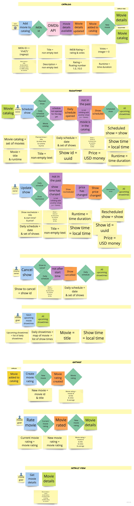

## Business domain and features

All required features and business details are discovered and refined using an [Event Storming technique](https://www.eventstorming.com/).

Screenshots of event storming sessions outcomes are generated from Miro tool and present in the docs.

### Event storming session
Event Storming sessions are performed according to a functional-programming-driven variation of Event Storming.

*Legend*

*Big Picture Event Storming*

### User stories

User stories are created during an Event Storming session, by forming use-case flows out of Event Storming stickies. 

Each use case flow is accompanied by a set of business terms definitions. Every business term can be described in a specific context by one of three mathematical constructs:
* Term = A (means that Term is something else, e.g. Age **is a** number bigger than 0)
* Term = A & B & ... (means that Term is a couple of things at once, e.g. Money is amount **and** currency unit)
* Term = A | B | ... (means that Term is one of couple other things, e.g. Fruit is either Apple **or** Orange **or** yet sth else)

*Legend*

